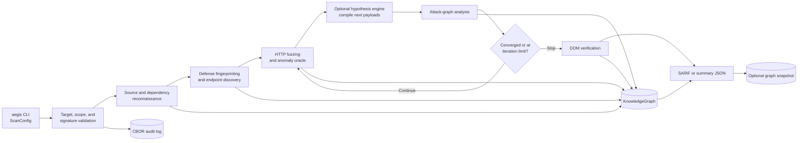
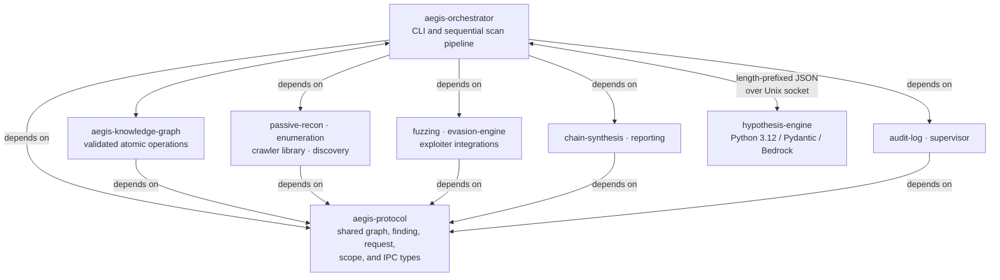

# AEGIS

AEGIS is an experimental, authorized web-application security scanner. Its main
`aegis` binary combines source and dependency reconnaissance, API discovery,
defense fingerprinting, mutation-based HTTP fuzzing, attack-graph analysis, and
structured reporting around a shared knowledge graph.

The project is aimed at security engineers and researchers. Each phase contributes
typed operations to a shared graph, making endpoint, finding, and attack-path state
available to later phases and reports. The repository also contains vulnerable
Express, Flask, and GraphQL applications with ground-truth manifests for repeatable
evaluation.

> **Use only against systems you own or are explicitly authorized to test.**
> Localhost targets are accepted by default. Remote targets require either
> `--i-am-authorized` or a matching Ed25519 scope attestation.

## What is implemented

| Area | Current behavior |
| --- | --- |
| Reconnaissance | Walks a source tree, parses supported dependency lockfiles, and can correlate dependencies with a local OSV-derived SQLite database. |
| Endpoint discovery | Reads live or local OpenAPI documents, attempts GraphQL introspection, and parses routes from Flask/FastAPI, Express, Spring, and Rails source. |
| Active testing | Builds fuzz targets from discovered endpoint parameters, mutates class-specific payloads, sends them through an evasion-aware HTTP transport, and scores response anomalies. |
| Authenticated scanning | Executes configurable multi-step authentication flows, injects extracted headers/cookies, and retries authentication after `401` responses. |
| Adaptive loop | Repeats fuzzing and graph analysis until the configured iteration or convergence limit. Optional Python-generated hypotheses become payloads for the next iteration. |
| Evidence model | Applies typed node, edge, and finding operations to a validated in-memory `KnowledgeGraph`; optional snapshots support later runs, while a pre-populated scan-history database can inform LLM confidence rates. |
| Reporting | Emits developer or security SARIF 2.1.0, or executive summary JSON. Business context can weight critical/PII endpoints and annotate accepted findings. |
| Audit and scope | Records scan events in a SHA3-256 hash chain with HMAC verification; supports signed scope documents and signed scan configurations. |

The default output is `aegis-report.sarif`. A scan also creates an audit log and
an adjacent HMAC key unless `--no-audit` is supplied.

## Scan workflow

The main binary executes phases sequentially. Endpoint discovery currently occurs
inside fingerprinting; the separate crawler library is not yet invoked by this
path.



With the `quick` preset, AEGIS runs one iteration and disables the Python
hypothesis engine. `thorough` and `paranoid` enable multiple iterations, allowing
generated payloads to feed a subsequent fuzz pass.

## Architecture



Important boundaries:

- **`aegis-protocol`** owns shared contracts. Capability crates exchange
  `GraphOperation`, `FuzzRequest`, `FindingData`, and scope/IPC types without
  depending on the orchestrator.
- **`aegis-knowledge-graph`** is the scan state boundary. It validates complete
  operation batches before atomically applying them under a `parking_lot::RwLock`.
- **`aegis-orchestrator`** integrates the working scan path. Phases communicate
  through `ScanContext` and the `GraphStore` trait, which tests can replace with
  an in-memory mock.
- **`hypothesis-engine`** is a separate Python process. The active bridge keeps a
  Unix-domain socket open and exchanges length-prefixed JSON frames; an LLM
  failure degrades to the static fuzzing path.
- **Persistence is explicit.** Graph snapshots and resume checkpoints are JSON;
  vulnerability data and the scan-history API use SQLite. The active pipeline
  reads history rates but does not write payload outcomes, and the in-memory graph
  operation log is not preserved in graph snapshots.

## Technology choices

| Technology | Role and rationale in this codebase |
| --- | --- |
| Rust 2024 + Tokio | The scanner, transports, storage, CLIs, and test infrastructure; async I/O is concentrated in network and orchestration boundaries. |
| `clap` | Typed CLI configuration, grouped into pipeline, scope, auth, audit, distributed, and tuning options. |
| `parking_lot` + typed operations | Concurrent graph reads with atomic validate-then-apply writes. |
| `petgraph` | Attack-path and graph analysis without implementing graph algorithms from scratch. |
| `reqwest` / `hyper` / `axum` | Outbound scan traffic, the recording-proxy library, and the demo web dashboard. |
| `rusqlite` with bundled SQLite | Portable vulnerability and proxy persistence, plus the scan-history storage API. |
| SARIF 2.1.0 + CBOR | Tool-compatible findings and compact audit/certificate records. |
| Python 3.12 + Pydantic + boto3 | Validated LLM request/response models and the optional Amazon Bedrock hypothesis backend. |
| Docker Compose | Known-vulnerable and defended applications used by integration and ground-truth tests. |

## Repository map

| Path | Purpose |
| --- | --- |
| `crates/orchestrator/` | Main `aegis` binary, scan phases, configuration, checkpoints, and integration tests. |
| `crates/protocol/` | Shared domain and IPC types. |
| `crates/knowledge-graph/` | Graph storage, validation, queries, and snapshots. |
| `crates/fuzzing/`, `crates/evasion-engine/` | Scheduling, mutation, anomaly detection, personas, pacing, and HTTP transport. |
| `crates/passive-recon/`, `crates/enumeration/` | Source/dependency analysis and API/route discovery. |
| `crates/chain-synthesis/`, `crates/reporting/`, `crates/compliance/` | Attack-path analysis, risk scoring, SARIF/JSON output, and security mappings. |
| `crates/audit-log/`, `crates/supervisor/` | Hash-chained audit records and capability-token primitives. |
| `crates/proxy/` | Recording proxy, repeater/intruder models, and SQLite persistence library. |
| `crates/aegis-*/`, `crates/*-daemon/` | Experimental operator interfaces, arena, and specialized daemon packages. |
| `hypothesis-engine/` | Optional Python hypothesis generation and payload compilation service. |
| `defense-stacks/` | Dockerized Express, Flask, GraphQL, rate-limit, bot-detection, and ModSecurity fixtures. |
| `.github/workflows/` | Rust/Python checks and Docker integration jobs. |

## Quick start

### Prerequisites

- Rust nightly and Cargo (the CI workflows use nightly)
- Docker with Compose for the fixture-backed example
- Python 3.12 and [`uv`](https://docs.astral.sh/uv/) only for the optional
  hypothesis engine

Install the Rust toolchain and build the main binary:

```bash
rustup toolchain install nightly
cargo +nightly build -p aegis-orchestrator
```

Start the checked-in Express fixture:

```bash
docker compose -f defense-stacks/compose/docker-compose.yml up -d --build --wait
```

Run a one-pass scan without LLM credentials:

```bash
cargo +nightly run -p aegis-orchestrator -- \
  --target http://127.0.0.1:3000 \
  --preset quick \
  --source-dir defense-stacks/express-vuln-app \
  --output aegis-report.sarif
```

Run `cargo +nightly run -p aegis-orchestrator -- --help` for endpoint filters,
authenticated flows, persistent graph/history paths, report formats, telemetry,
and tuning options. The binary also dispatches `recon`, `attest`, and `update-db`
before the main scan parser.

### Optional hypothesis engine

The persistent bridge currently creates the Bedrock backend. Configure AWS
credentials with permission to invoke the configured model, then install the
Python package and point AEGIS at its virtual-environment interpreter:

```bash
cd hypothesis-engine
uv sync --extra dev
cd ..

cargo +nightly run -p aegis-orchestrator -- \
  --target http://127.0.0.1:3000 \
  --preset thorough \
  --source-dir defense-stacks/express-vuln-app \
  --python-cmd hypothesis-engine/.venv/bin/python
```

If the bridge cannot start or an LLM request fails, the scan logs a warning and
continues with static payload generation.

When finished with either example, stop the fixture:

```bash
docker compose -f defense-stacks/compose/docker-compose.yml down -v
```

## Quality checks

Tier 1 CI runs formatting, Clippy with warnings denied, Rust workspace tests, and
the Python tests colocated under `src/hypothesis_engine`. Run the broader local
set with:

```bash
cargo +nightly fmt --all --check
cargo +nightly clippy --workspace -- -D warnings
cargo +nightly test --workspace

cd hypothesis-engine
uv run pytest src/hypothesis_engine/ tests/ -v
```

Docker integration tests are opt-in and serialized because they share fixture
ports:

```bash
AEGIS_INTEGRATION_TESTS=1 cargo +nightly test \
  -p aegis-orchestrator --test docker_integration -- --test-threads=1
```

Ground-truth files live beside each fixture application, so detection behavior
can be compared with explicit expected findings rather than only mocked responses.

## Current scope and limitations

- The standalone `aegis-crawler` implements localhost-only BFS crawling, but the
  main pipeline currently passes an empty `CrawlResult`. Both `--skip-crawl` and
  `--headless-crawl` are therefore inert in this path.
- The scan TUI always emits simulated events. The web UI starts events only in
  `--demo` mode; a non-demo target is not connected to the orchestrator.
- The `aegis-proxy` library records and persists HTTP exchanges, but
  `aegis-proxy-tui` currently prints its configuration and exits without starting
  that proxy.
- The C2 console and specialized daemon crates are experimental surfaces with
  placeholder or local-state behavior. They should not be read as deployed
  command-and-control or distributed scanning capabilities.
- Several external-tool wrappers exist, but availability and integration vary.
  The main fuzz path uses Dalfox only as an optional XSS confirmation step.
- Graph diffing is limited for fuzz findings whose stable IDs are not populated;
  those findings are treated as new on later scans.
- The active pipeline can read class confirmation rates from `--history-db`, but
  it does not currently write payload outcomes to that database.
- Package manifests declare MIT, but the repository does not currently include a
  top-level license file.
